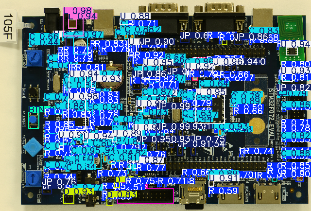

# PCB component detection API

Using yolov8 to detect PCB component

| Key | Description                | Number of instances |
| --- | -------------------------- | ------------------- |
| 1   | Resistor (R)               | 7246                |
| 2   | Capacitor (C)              | 6896                |
| 3   | Integrated Circuit (U)     | 761                 |
| 4   | Discrete Transistor (Q)    | 616                 |
| 5   | Connector (J)              | 579                 |
| 6   | Inductor (L)               | 473                 |
| 7   | Resistor Coil (RA)         | 404                 |
| 8   | Diode (D)                  | 362                 |
| 9   | Resistor Network (RN)      | 330                 |
| 10  | Test Point (TP)            | 266                 |
| 11  | Integrated Circuit (IC)    | 237                 |
| 12  | Plug (P)                   | 200                 |
| 13  | Thyristor (CR)             | 194                 |
| 14  | Motor (M)                  | 74                  |
| 15  | Button (BTN)               | 72                  |
| 16  | Ferrite Bead (FB)          | 69                  |
| 17  | CRA                        | 54                  |
| 18  | Switch (SW)                | 50                  |
| 19  | Transformer (T)            | 47                  |
| 20  | Fuse (F)                   | 44                  |
| 21  | Vaccum Tube (V)            | 41                  |
| 22  | Light Emitting Diode (LED) | 39                  |
| 23  | Switch (S)                 | 37                  |
| 24  | QA                         | 36                  |
| 25  | Jumper Link (JP)           | 31                  |

## 1. Predict return json

**Body Form-data**

| Key  | Required | Description           |
| ---- | -------- | --------------------- |
| file | yes      | Image file to predict |

**Curl Command**

```bash
curl --location 'http://localhost:8000/api/v1/predict' \
--form 'file=@"/home/hungdq30/Downloads/pcb_105f_cc_33.png"'
```

**Response**

```
{
    "image_shape": {
        "height": 5381,
        "width": 7933
    },
    "speed": {
        "preprocess": 22.40586280822754,
        "inference": 764.0213966369629,
        "postprocess": 1.9803047180175781
    },
    "predictions": [
        {
            "class_id": 24,
            "confidence": 0.9915357828140259,
            "bounding_box": {
                "xmin": 3995,
                "ymin": 2782,
                "xmax": 4105,
                "ymax": 2997
            }
        },
        {
            "class_id": 24,
            "confidence": 0.9877756834030151,
            "bounding_box": {
                "xmin": 3996,
                "ymin": 3299,
                "xmax": 4107,
                "ymax": 3521
            }
        },
    ]
}
```

## 2. Predict return image

**Body Form-data**

| Key         | Required | Description              |
| ----------- | -------- | ------------------------ |
| file        | yes      | Image file to predict    |
| img_size    | no       | Size of the return image |
| show_conf   | no       | Show confidence          |
| show_labels | no       | Show label               |
| show_boxes  | no       | Show boxes               |
| line_width  | no       | Line width of boxes      |

**Curl Command**

```bash
curl --location 'http://localhost:8000/api/v1/predict' \
--form 'file=@"/home/hungdq30/Downloads/pcb_105f_cc_33.png"' \
--form 'img_size="640"' \
--form 'show_conf="False"' \
--form 'show_labels="False"' \
--form 'show_boxes="False"' \
--form 'line_width="18"'
```

**Response**

